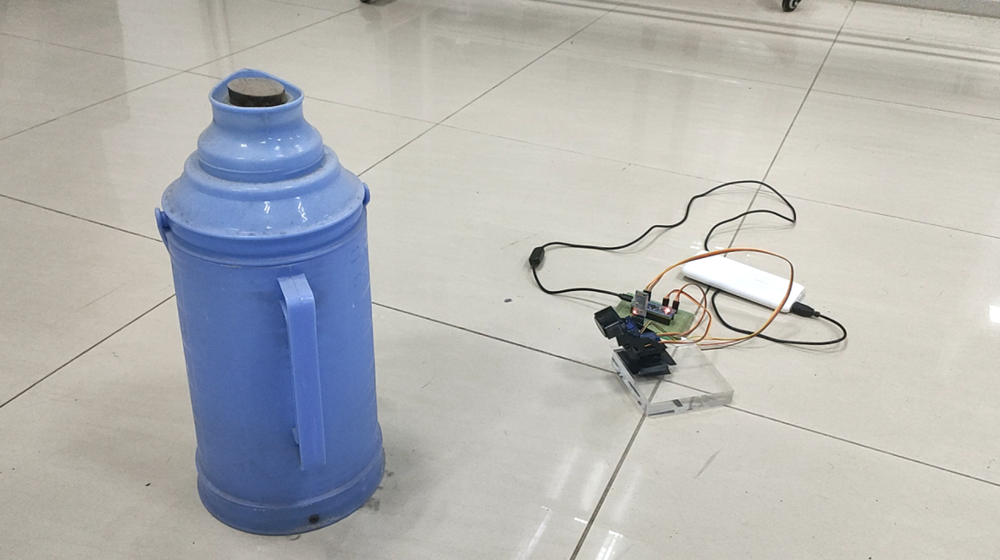
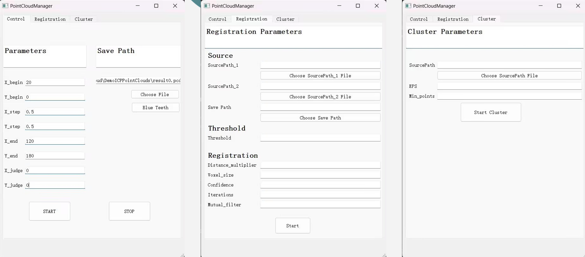
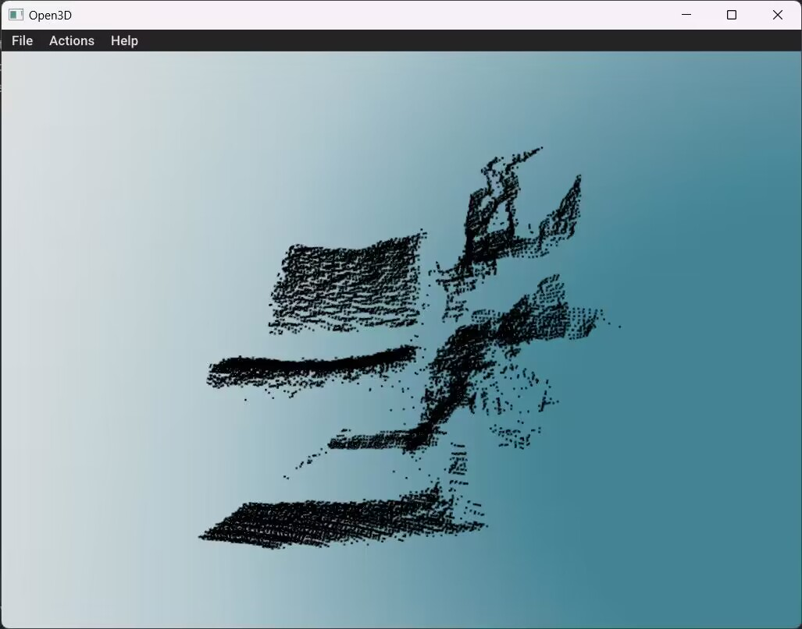
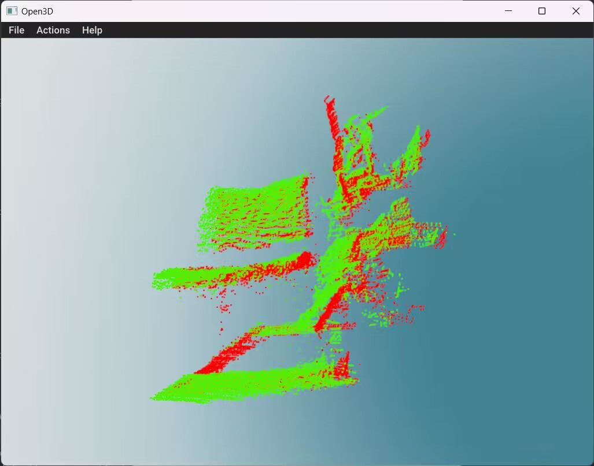
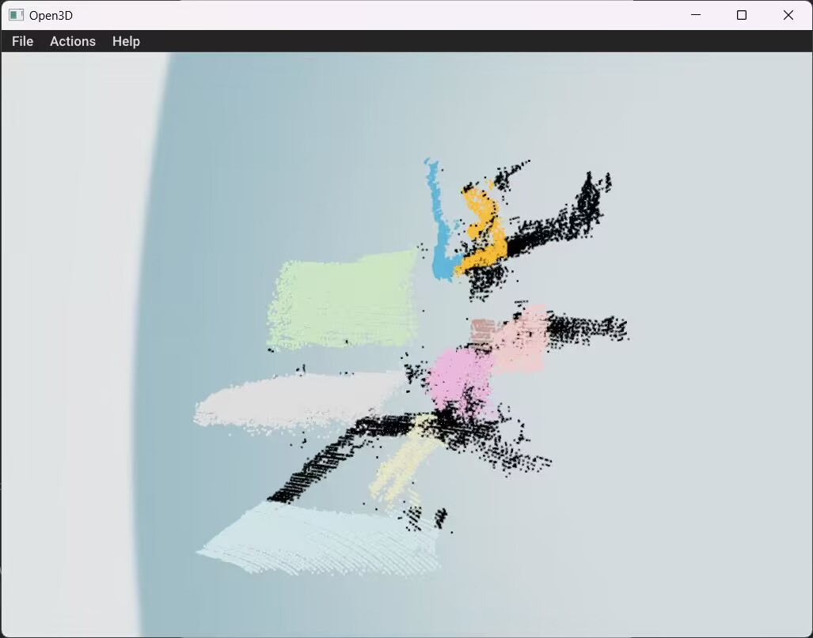

## 简易的点云扫描仪

### 0.项目说明

​	这个作品是我们拿来打2023年华为嵌入式软件大赛的作品，本来只是因为看到参与就可以获得一个小证书，所以只是想拿一个小证书。但是没想到却进入了复赛。本以为自己的作品和其他人是同水平的，但是其他人的作品都大概是直接从各自的实验室拿出来的很成熟的项目，所以几乎被完虐。在比赛现场见到了很多师兄师姐的作品，对我来说就是获得了很多的idea。

​	我们的作品是一个三维激光空间扫描仪，成本很低不到200（市面上一个这玩意至少大几千几万刀），效果一般，但是还是挺有趣的，可以当成一个科技小制作。这是主要部分两个舵机组成的2自由度平台和一个激光（其实是红外）测距模块，控制器采用stm32f103，控制器控制平台转到固定角度，再发送测距指令获得距离。最后把数据通过串口传输到上位机进行进一步处理。

### 1.材料

1. 舵机*2和一个2自由度支架
2. ToF激光测距模块
3. stm32f103c8t6最小系统板
4. 串口模块（这里使用的是蓝牙HC-05）

### 2.硬件设备及代码

​	硬件采用stm32f103c8t6最小系统板，串口连接PA9,PA10,激光测距模块连接PA2,PA3,舵机由时钟生成的pwm波控制，控制极角的舵机连接PB0，控制方位角的舵机连接PB1。这些外设的供电电压都是5v，我图方便直接并联在了最小系统板上的5v，这个5v似乎是直接连到usb的5v供电没有稳压，所以可以自己再加个稳压。

​	代码用Keil5 MDK 下载到最小系统板即可。

### 3.上位机

​	我的上位机是由python3.9环境写的一个用于连接蓝牙设备，接收串口数据，数据处理（点云图生成并保存，图像配准，图像聚类）的一个程序。需要安装open3d，串口库pyserial，界面pyQt5库（能安装上这些就可以运行）。

### 4.效果图

实际场景以及效果

.JPG)

图形界面

扫描点云图（一个椅子和背景，右边堆了很多杂物）

两图像配准

聚类

